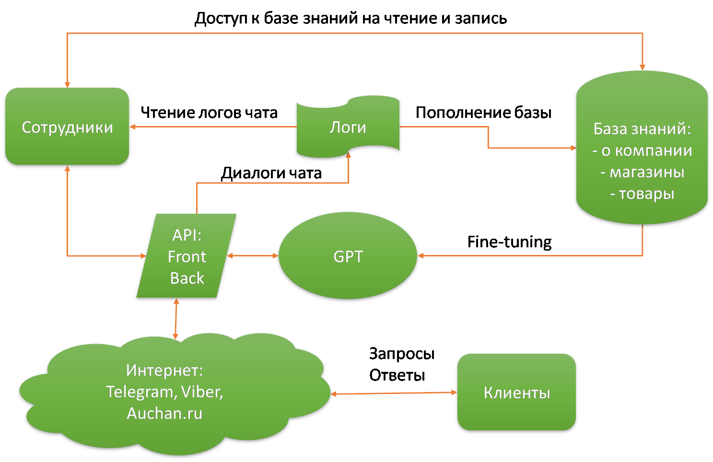
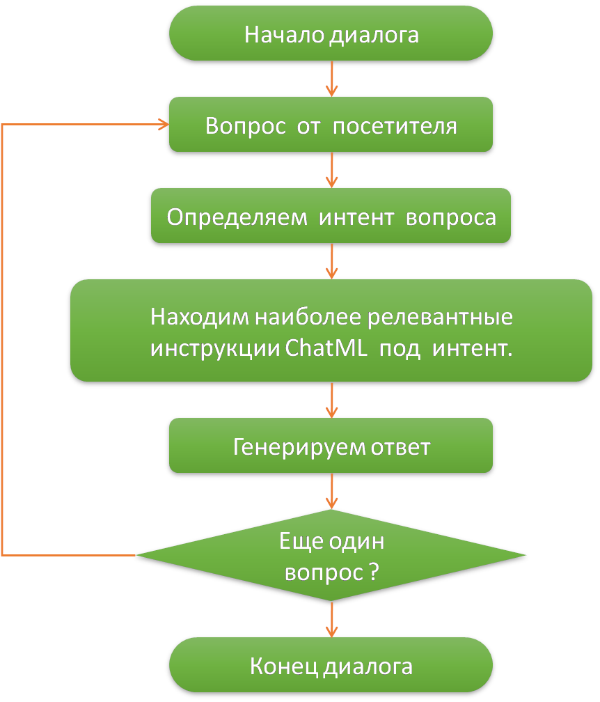

Hackathon: 4-19 августа 2023, https://ai-hackathon.gigaschool.ru/

# AI Generative Product

## Cоздание инновационных продуктов с помощью AI-технологий

Стек: `jupyter-notebook`, `python`, `openai`, `tiktoken`, `pyTelegramBotAPI`,`ChatGPT-4`, `YandexGPT`, `Яндекс DataSphere`, `Яндекс SpeechKit`, `Яндекс Vision`

## Кейс: АШАН: использование искусственного интеллекта в работе контакт-центра

Аретфакты проекта:
- [Telegram bot "Ашанчик"](#)
- [jupyter notebook настройка GPT-4 ChatML](#)
- [Презентация](#)

---

## Организаторы

- Федеральное государственное автономное образовательное учреждение высшего образования «Национальный исследовательский университет ИТМО»
- Napoleon IT — один из крупнейших AI-разработчиков программного обеспечения.
- AI Talent Hub – онлайн-комьюнити специалистов по машинному обучению.
- KONNEKTU - инновационная, многофункциональная платформа по управлению данными и взаимодействию с потребителями.

## Партнёры

#### Unilever в России, Yandex Cloud, Альфа-Банк, Danone, АШАН Ритейл Россия, Tefal, xpage, PeopleDo.

## Описание кейса

<b>Что необходимо сделать?</b>

Разработать решение на основе AI, которое обеспечит круглосуточную поддержку существующего контакт-центра: ответы на общие вопросы о компании, ее часах работы, адресах и контактных данных. Также AI будет обрабатывать запросы на возврат, при необходимости запрашивать фотографии продуктов и чеков, и перенаправлять обращения на операторов.

Данное решение также должно предоставлять информацию о продуктах, услугах компании и наличии товаров в конкретных магазинах, включая консультации по составу и особенностям товаров, ценам, условиям доставки и оплаты. Например, если клиент интересуется наличием товара в определенном магазине, AI вступает в диалог с клиентом, задавая уточняющие вопросы и помогая осуществить подбор продукта.

Дополнительно AI будет генерировать ответы на простые вопросы и предлагать их операторам для ответа клиентам. Он также будет указывать рекомендуемые дальнейшие действия и отвечать на часто задаваемые вопросы (FAQ), которые можно будет отправлять клиентам по электронной почте или SMS. AI должен производить анализ отзывов и обратной связи клиентов для выдачи рекомендаций по улучшению качества услуг и продуктов компании.

Важной частью решения является интеграция в существующий чат-бот на сайте и в мобильном приложении. ИИ будет отвечать на стандартные запросы пользователей, связанные с работой магазинов в различных каналах продаж (офлайн, онлайн, доставка, самовывоз и т.д.), а также на запросы, связанные с ассортиментом, сервисами и программой лояльности Ашан.

Для удобства использования, на первом этапе реализации, мы предлагаем создать текстовый чат-бот, но в перспективе предлагаем дополнить его вариантом голосового решения.

Кроме того, решение должно обладать дополнительными требованиями, включая автоматическое создание полной аналитики о его применении - от табличных отчетов до дашбордов. Также должна быть реализована возможность рассылки сообщений в указанные каналы общения и перевода переписки на другие мессенджеры. И, конечно, наше решение будет легко интегрироваться в существующую CRM систему.

<b>Какая проблема существует?</b>

Ашан активно использует значительное количество человеческих ресурсов на первой линии для обработки запросов клиентов. Однако создание AI-решения для контакт-центра и чат-бота предоставит возможность обрабатывать большой объем запросов с высокой скоростью, что существенно снизит нагрузку на операторов. Это в свою очередь приведет к отсутствию очередей на линии и позволит сотрудникам сосредоточиться на решении сложных и комплексных задач. Такой подход снизит стоимость обслуживания клиентов и сократит необходимое количество ресурсов, что будет существенным преимуществом для компании.

<b>Результат продукта</b>b>

Чат-бот должен специализироваться в области генерации осмысленных ответов на вопросы клиентов, а также собирать и анализировать клиентские данные из всех каналов (действия на сайте, текстовый анализ последних чатов или опросов, электронные письма). На основе этого выводить подходящие рекомендации.

<b>Функциональные требования</b>

- Качественное распознавание текста.
- Соответствие бота заданному формату
- Сгенерированный текст отвечает заданному в запросе стилю.
- Итоговый текст не требует ручного редактирования.
- Умение проводить анализ изображений. Точно определять, что именно находится на фотографии, вплоть до мелких деталей.
- Приложение должно задавать пользователю грамотные вопросы для сбора данных о текущей проблеме.
- Приложение должно анализировать информацию, предоставленную пользователем, и предлагать соответствующие рекомендации.
- Приложение должно быть легким в использовании и иметь удобный интерфейс для ввода данных.
- Приложение должно обеспечивать безопасность данных и конфиденциальность пользовательской информации.

<b>Как созданное решение использовать как постоянный сервис</b>

- Важно настроить интеграцию с CRM, сайт Auchan.ru, Мобильное приложение.
- Обновление базы знаний и информации должно быть регулярным.
- Решение на основе AI может использоваться для рекламы продуктов и услуг, напоминания о предстоящих акциях и скидках, а также для сбора обратной связи от клиентов.
- Доступ к решению может быть предоставлен различным категориям пользователей в зависимости от их роли и функций, таких как операторы контактного центра, менеджеры проектов или аналитики.

<b>Дополнительная информация</b>

При разработке решения также необходимо предусмотреть функции, которые позволят модели обучаться и самообучаться. Это важно для обеспечения адаптивности и актуальности решения, так как данные и потребности пользователей могут меняться со временем.

Особое внимание следует уделить мерам по обеспечению безопасности данных и конфиденциальности пользователей. Необходимо применить соответствующие технологии и методы для обеспечения защиты данных от несанкционированного доступа, утечек или злоупотребления.

Общее внимание к обеспечению качества данных, способности к самообучению и безопасности информации является основой для успешной разработки решения на основе искусственного интеллекта. Эти факторы позволят создать надежное, эффективное и безопасное решение, которое сможет решать задачи с высокой точностью и уровнем доверия со стороны пользователей.

---

## Решение кейса

Учитывая масштаб и разнообразие задач кейса, и для лучшего понимания, решено протестировать текущую работу контакт-центра. На основании полученного опыта, предложить варианты интеграции технологий искусственного интеллекта в данный кейс.

На текущий момент, у магазина Ашан имеется круглосуточная поддержка клиентов:

- в тестовом формате:
    - форма обратной связи (https://www.auchan.ru/feedback/)
    - чат на официальном сайте (https://www.auchan.ru/)
    - бот в Телеграм (https://t.me/AuchanRusbot)
    - бот в Вайбер (viber://pa?chatURI=auchanrusbot)
- в голосовом формате:
     - многокональный телефон 8-800-700-5-800

Все текстовые сервисы имеют четко заданную структуру и алгоритмы для сбора данных относительно выбранного вопроса и предполагают, что пользователь точно знает, чего хочет и как должен действовать. Но на практике такое бывает не всегда, и чаще всего человеку просто нужна консультация. В этом случае у сервисов имеется возможность переключения пользователя на общение с сотрудником магазина.

Наша задача состоит в том, чтобы простые и типичные вопросы, которые возникают у клиентов, решались в процессе диалога с интеллектуальным помошником. Это позволит снизить нагрузку на операторов и улучшить качество обслуживания, так как клиенты смогут задавать вопросы и получать ответы, как если бы они общались с живым человеком.

**Что решено делать**

Так как сроки решения кейса ограничены, а список задач достаточно широк, принято решение в качестве MVP создать телеграм-бота и интегрировать в него возможности современных генеративных сетей GPT для ответов на вопросы клиентов по теме Ашан.

А если останется время, то можно будет дополнить проект такими возможностями, как CV (computer vision), TTS (text to speech) и VTT (voice to text). Например, для решения вопроса по возврату товара, покупатель сможет загрузить фотографии самого товара и чеков, а интеллектуальный помощник по фото определит товар и распознает информацию в чеке. Если кто-то не любит набирать текст, то сможет продиктовать сообщение голосом, и интеллектуальный помощник сможет преобразовать голосовое сообщение в текст и на него ответить. Ответ помощника также может быть озвучен.

Для решения обозначенного круга вопросов и задач нам предоставлены все необходимые инструменты: доступ к облачным сервисам Яндекса и API-ключ Open AI для работы с моделями GPT.

**Примерная схема реализации сервиса "Интеллектуального помощника Ашанчик"**

**Основные проблемы**

На сегодняшний день написание ботов и использование моделей GPT не является сверхзадачей, но есть проблемы, которые необходимо решить для достижения успеха: 

1. Модели GPT устроены таким образом, что могут генерировать ответы по неограниченному кругу вопросов. Нам не нужна такая универсальность. Наша задача состоит в том, чтобы ограничить генерацию ответов тематикой, относящейся к магазинам "Ашан". 

2. Известно, что модели GPT часто выдумывают недостоверную информацию, и это также один из критических моментов, так как выдуманная информация может ввести пользователя в заблуждение и это может негативно сказаться на репутации магазина. То есть, наш ассистент не должен искажать факты или выдумывать несуществующую информацию. 

3. У всех моделей GPT есть технические ограничения по количеству токенов. Данный технический параметр определяет, какую глубину контекста в диалоге способна воспринимать модель. Это ограничение не дает нам возможности передать модели сразу всю базу знаний о магазине. То есть, нам необходимо реализовать механизм настройки модели под текущие узкие локальные задачи, например, информация о возврате товаров или информация по доставке товаров.

Учитывая указанные проблемы, мы протестировали разные генеративные модели на диалогах:

- LLaMA2
- YaGPT
- ChatGPT gpt-3.5-turbo
- ChatGPT gpt-3.5-turbo-16k
- ChatGPT gpt-4

Для реализации мы выбрали модель gpt-4, т.к. она наилучшим образом соотвествует перечисленным требованиям.

К настроке работы модели можно подойти двумя способами:

1. Fine-tuning. Данный способ предполагет подготовку качественного дататсета и дообучение модели.

2. Изменение поведения модели на лету с использованием инструкций в формате ChatML.

Мы выбрали второе решение, т.к. оно нам показалось более гибким и менее затратным по времени.

Схема ниже демонстрирует принцип построения диалога и настроки модели налету с применением ChatML.

Для распознавания голосовых сообщений от клиентов и перевода в текст мы использовали хорошо зарекомендовавшую себя технологию Яндек SpeechKit. Её же использовали для озвучивания текстов ответов генеративной сети.

Для распознавания текстов на чеках применили сервис Яндекс Vision. А для коррекции распознанной информации обращались к модели ChatGPT-4.

## Выводы

1. Мы получили опыт настройки современной генеративной модели ChatGPT-4 для ведения достаточно адекватных диалогов в пределах заданной тематики с использованием разметки ChatML.

2. Выполнили интеграцияю генеративной модели с чат-ботом в Телеграм.

3. Применили механизмы преобразования текста в голос и обратно.

4. Применили механизмы загрузки и анализа информации на изображении.

5. Обеспечили возможно сохранения лога диалогов в базу данных.

Таким образом мы смогли реализовать MVP решение по данному кейсу.

Уверены, что данное решение, при определенной доработке, может быть вполне жизнеспособным и поможет снизить количество человеческих ресурсов на первой линии для обработки запросов клиентов.

Наш AI-асситент актулен не только в сфере ритейла, но так же может быть адаптирован для применения в любой отрасли, где требуется обработка заявок и сообщений от клиентов.

---

### Благодарности

Большое спасибо организаторам за возможность получить такой полезный опыт и участвовать в актуальном современном кейсе.
Так же большое спасибо партнерам хакатона за предоставление всех необходимых инструментов и технологий для реализации решения.

### Команда "K2"

Менеджмент проекта:

	- Давыдова Евгения

Специалисты Data Science:

	- Папин Алексей

	- Балычева Ирина

	- Григорьев Александр

---

Полезные ссылки:
- [Кейсы хакатона](https://ai-hackathon.gigaschool.ru/cases)
- [Notion](https://www.notion.so/52ace571c70b47cc9dc8758e497f5ecb)
- [Meet](https://meet.google.com/xch-zodw-xaa)
